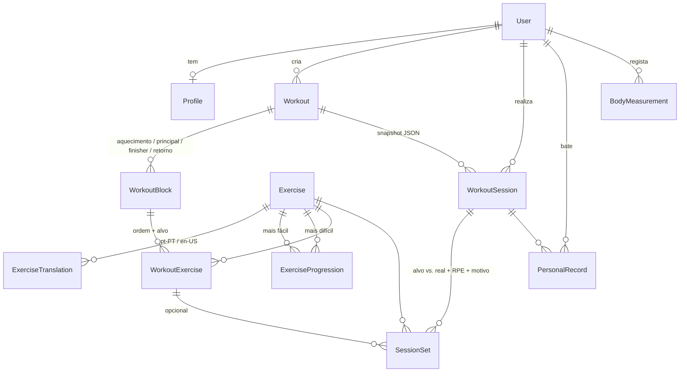

# This Little Coach — Plano de Arquitetura (Fase 1: MVP)

> Estado: **proposta para aprovação**. Nada de código de aplicação foi escrito
> além do esquema de dados e do esqueleto do repositório.

## 1. Visão

Uma super app de fitness onde o treino se adapta à pessoa em tempo real. O que
existe hoje no repositório é um protótipo PWA (`index*.html`) com um domínio já
rico: perfil biométrico, programas (PPL, Full Body, Upper/Lower), ênfase
(glúteos/tronco), modos de vida (férias, pausa, doente), nutrição e peso. Este
plano transforma esse protótipo num produto nativo, multi-utilizador e com um
motor de IA.

Os protótipos ficam intactos na raiz por agora (podem estar publicados via
GitHub Pages). Sugiro movê-los para `docs/prototype/` quando confirmares que
não estão em uso.

## 1.1 O que já existe e é reaproveitado do protótipo

O protótipo (`index.html`, ~120 funções) **não é substituído**: é a
especificação funcional e a fonte de conteúdo. Mapa do que migra para onde:

| No protótipo                                                        | Destino no novo sistema                                                    | Fase |
| ------------------------------------------------------------------- | -------------------------------------------------------------------------- | ---- |
| `CANON` / `CANONMAP` (catálogo canónico + variantes por equipamento) | `Exercise` + `ExerciseTranslation` + seed; variantes viram `ExerciseProgression` e filtros por `equipment` | 1 |
| `applyProfile` (sexo, idade, altura, peso, %MG, objetivo, foco, dias, programa, experiência, equipamento) | `Profile` (campos 1:1) + `BodyMeasurement`                              | 1 |
| `MODES` (normal, férias, pausa, doente) e `autoTune`               | `Profile.activeMode`; lógica de auto-ajuste → `packages/shared/domain`      | 1–2 |
| `WK_PPL`, `WK_FB`, `WK_SIM`, `WK_ELA`, Upper/Lower, `buildWK`/`adaptEx` | Templates `Workout` com `source: SYSTEM`; `adaptEx` é o embrião do gerador em `@tlc/shared/workout-engine` | 1 |
| Player (`startSession`, `plLogSet`, `plRate`, `addSet`, `pickAlt`) | `WorkoutSession` + `SessionSet` (incl. `substitutedFromId`, RPE)            | 1 |
| `calcRM`, `tonnage`, `exStats`, `lastPerf`                         | `PersonalRecord` + endpoints de progresso                                   | 1 |
| `weights`, `avg7`, `etaGoal`, `journeyCard`, gráficos               | `BodyMeasurement` + ecrã de progresso                                       | 1 |
| Multi-utilizador local (`switchUser`, `otherId`) para o casal        | `User` real por pessoa; "modo casal" vira `Household` no módulo social      | 3 |
| `FOODS`, `ING`, `KT`, `maintKcal`, `macroT`, `tdee`, `deficit`, água, cardio | Módulo de nutrição (`DailyLog`, `Food`, `NutritionTarget`); as fórmulas migram tal e qual | 3 |
| `expData` / `impData` (export/import JSON)                          | Importador one-shot do histórico do protótipo para a nova BD                | 1 (final) |

Regra prática: sempre que um módulo novo arranca, a primeira tarefa é ler a
função correspondente no protótipo e portar a regra de negócio, não reinventá-la.

## 2. Decisões de stack

Detalhe e alternativas em [`adr/0001-stack.md`](adr/0001-stack.md).

| Camada          | Escolha                                   | Porquê                                                                                          |
| --------------- | ----------------------------------------- | ----------------------------------------------------------------------------------------------- |
| Mobile          | **Expo (React Native) + TypeScript**      | Uma base de código iOS/Android, OTA updates, partilha de tipos com o backend, ecossistema maduro |
| API             | **NestJS**                                | Modular por natureza, DI, tipos partilhados end-to-end com o mobile                             |
| Dados           | **PostgreSQL (Supabase) + Prisma**        | Relacional, migrações versionadas, tipos gerados                                                |
| Auth / Realtime | **Supabase Auth**                         | Email, Apple, Google prontos; a API só valida JWT                                               |
| Cache / filas   | **Redis** (Fase 2)                        | Cache de catálogo, rate-limit, jobs de recomendação                                             |
| IA              | TypeScript (regras + LLM) na Fase 1–2; **FastAPI** só se houver ML próprio | Evita um segundo runtime até ser mesmo necessário                     |
| Monorepo        | **pnpm workspaces + Turborepo**           | Um `pnpm install`, builds com cache, pacotes partilhados                                        |

Duas sugestões que divergem do enunciado:

1. **Não começar com FastAPI.** O motor adaptativo da Fase 2 é, em grande parte,
   regras determinísticas (progressão por RPE, volume, padrões de movimento) mais
   chamadas a um LLM para personalização. Isso vive bem em TypeScript e evita
   duplicar modelos de dados em dois runtimes. Reservamos `services/ai-engine`
   (Python) para quando houver modelos treinados por nós.
2. **O gerador de treinos é uma função pura em `packages/shared`.** Assim corre
   na API *e* offline no telemóvel, e testa-se sem base de dados.

## 3. Estrutura do repositório

```
this-little-coach/
├── apps/
│   ├── mobile/          # Expo / React Native (feature-first)
│   └── api/             # NestJS (um módulo por bounded context)
├── packages/
│   ├── database/        # Prisma: schema, migrações, PrismaClient singleton   ✅ criado
│   ├── shared/          # domínio puro: schemas Zod, workout-engine, calorias
│   └── config/          # tsconfig / eslint / prettier partilhados
├── services/            # (Fase 2+) ai-engine em Python, se necessário
├── docs/
│   ├── ARCHITECTURE.md  # este documento
│   └── adr/             # decisões de arquitetura (uma por ficheiro)
├── index*.html          # protótipos PWA existentes (a mover para docs/prototype/)
├── package.json         # scripts do monorepo (turbo)
├── pnpm-workspace.yaml
├── turbo.json
└── .env.example
```

Convenções de código:

- **SOLID na API:** controllers finos, services com uma responsabilidade,
  repositórios sobre Prisma, DTOs Zod partilhados com o mobile.
- **DRY entre plataformas:** um tipo define-se uma vez em `@tlc/shared` e é
  usado pela API (validação) e pelo mobile (formulários e cliente HTTP).
- **Feature-first no mobile:** cada feature tem ecrãs, hooks e testes juntos.
- Testes unitários no domínio (`packages/shared`), testes de integração na API
  com base de dados efémera, testes E2E mobile com Maestro (mais tarde).

## 4. Modelo de dados (Fase 1)

Esquema completo em [`packages/database/prisma/schema.prisma`](../packages/database/prisma/schema.prisma);
SQL gerado em `packages/database/prisma/migrations/`.



### 4.1 Domínios

**Identidade e perfil.** `User` guarda apenas identidade (o `authId` aponta para
o Supabase Auth). `Profile` guarda tudo o que o gerador precisa: objetivo, nível,
ênfase, dias/semana, minutos por sessão, equipamento disponível, músculos a
evitar e o **modo de vida** (`NORMAL`, `VACATION`, `PAUSED`, `SICK`,
`RECOVERING`), herdado do protótipo.

**Catálogo de exercícios.** Cada `Exercise` é classificado por categoria,
**padrão de movimento** (push, pull, squat, hinge, lunge, core…), músculos
primários/secundários, equipamento, dificuldade 1–5 e métrica (reps, tempo,
distância). As traduções vivem à parte para servir PT-PT e EN. O grafo
`ExerciseProgression` (mais fácil → mais difícil) é a peça que permite trocar um
exercício por uma variante adequada, na Fase 1 pelo gerador e na Fase 2 em tempo
real.

**Treinos (templates).** `Workout` → `WorkoutBlock` → `WorkoutExercise`. Os
blocos têm tipo (aquecimento, principal, finisher, retorno à calma), **formato**
(séries, circuito, AMRAP, EMOM, Tabata…), rondas e descansos. Um treino gerado
guarda os `generationInput` (tempo, equipamento, energia) e a versão do gerador,
para ser reprodutível e para servir de dataset.

**Sessões realizadas.** `WorkoutSession` guarda um **snapshot JSON** do treino
no momento da execução, para que o histórico não mude quando o template evolui.
`SessionSet` regista, por série, alvo vs. realizado, RPE, se foi saltada, o
**motivo do ajuste** (`TOO_HARD`, `TOO_EASY`, `PAIN`, `OUT_OF_TIME`…) e o
exercício original em caso de substituição. Este é o sinal que o motor da Fase 2
vai aprender.

**Progresso.** `PersonalRecord` mantém o recorde atual por exercício e métrica.
`BodyMeasurement` guarda peso, % gordura e perímetros por dia, com origem
(manual ou importado de wearable).

### 4.2 O que fica preparado para as fases seguintes

| Fase | Necessidade                                   | Já coberto por                                                       |
| ---- | --------------------------------------------- | -------------------------------------------------------------------- |
| 2    | Ajuste de séries/reps em tempo real           | `SessionSet` (alvo vs. real, RPE, motivo), `ExerciseProgression`     |
| 2    | Ginásio com cargas                            | `targetLoadKg`, `loadKg`, `Equipment` completo                       |
| 2    | Wearables                                     | `SessionSource.IMPORTED`, `MeasurementSource.IMPORTED`               |
| 3    | Nutrição, ciclo menstrual, água, passos       | Novos modelos `DailyLog`, `NutritionTarget` (fora do MVP de propósito) |
| 3    | Gamificação / social / "modo casal"           | `User.role`, novos modelos `Household`, `Achievement`, `Streak`      |

## 5. Fluxos principais

**Onboarding progressivo.** Registo (Supabase) → a API cria `User` + `Profile`
vazio → 4 ecrãs (objetivo, nível, equipamento, tempo) → `onboardingCompletedAt`.
O utilizador consegue gerar o primeiro treino em menos de dois minutos; dados
biométricos são pedidos mais tarde, quando fazem diferença.

**Gerar treino de hoje.** Inputs: perfil + "quanto tempo tens?" + "como te
sentes?" (energia 1–5) + equipamento à mão. O gerador em `@tlc/shared` escolhe
o formato, equilibra padrões de movimento, filtra por equipamento e músculos
restritos, escala dificuldade pelo nível e pelo modo de vida, e devolve um
`Workout` (`source: GENERATED`) persistido pela API.

**Executar sessão.** `POST /sessions` cria a sessão com snapshot → o player
mobile guia série a série, com timer e cues → cada série gera um `SessionSet`
(gravado localmente e sincronizado) → no fim, RPE, humor e avaliação → a API
fecha a sessão, calcula calorias e verifica recordes.

**Histórico.** Calendário de sessões, volume semanal por padrão de movimento,
recordes e evolução de peso. Tudo derivado de `WorkoutSession`, `SessionSet` e
`BodyMeasurement`, sem tabelas de agregação nesta fase.

## 6. Inovação face ao mercado

O que, já na Fase 1, nos diferencia de um Freeletics:

1. **Check-in de energia antes do treino.** Uma pergunta ("como estás hoje?")
   muda o treino gerado. As apps atuais ignoram o estado do dia.
2. **Modos de vida.** Férias, doença ou pausa não "partem" a streak nem a
   progressão; o plano adapta-se em vez de culpar.
3. **Feedback por série, não por treino.** "Foi difícil / fácil / doeu / sem
   tempo" em um toque. É o que torna a IA da Fase 2 realmente adaptativa.
4. **Progressões explícitas.** O utilizador vê *porque* está a fazer flexões
   inclinadas e *o que* tem de atingir para passar às normais.
5. **Treino explicável.** Cada treino gerado guarda os seus inputs e pode dizer
   "escolhi um circuito de 20 min porque disseste ter pouca energia e só um
   tapete".

## 7. Roadmap de módulos (Fase 1)

| # | Módulo                          | Entrega                                                                 |
| - | ------------------------------- | ----------------------------------------------------------------------- |
| 0 | Esquema e repositório           | ✅ este PR                                                              |
| 1 | Seed do catálogo de exercícios  | ~60 exercícios de peso corporal com progressões e traduções PT/EN        |
| 2 | API: auth + utilizadores        | NestJS, guard JWT Supabase, `/me`, perfil, onboarding                    |
| 3 | Motor gerador de treinos        | `@tlc/shared/workout-engine` com testes unitários                        |
| 4 | API: workouts + sessões         | endpoints, snapshot, recordes, calorias                                  |
| 5 | Mobile: auth + onboarding       | Expo Router, Supabase, design system a partir do protótipo               |
| 6 | Mobile: gerador + player        | fluxo "treino de hoje", timer, feedback por série, offline-first         |
| 7 | Mobile: histórico e progresso   | calendário, recordes, peso                                               |

## 8. Riscos e pontos em aberto

- **Supabase RLS vs. API.** Proposta: o mobile fala sempre com a API (Prisma com
  credenciais de serviço); o Supabase serve Auth e, mais tarde, Realtime. RLS
  ligado apenas como defesa em profundidade.
- **Offline.** Sessões têm de sobreviver sem rede; o `SessionSet` é idempotente
  (id gerado no cliente) para permitir sincronização segura.
- **Conteúdo.** Vídeos e thumbnails dos exercícios são o maior custo de
  produção; começar com ilustrações/loops curtos.
